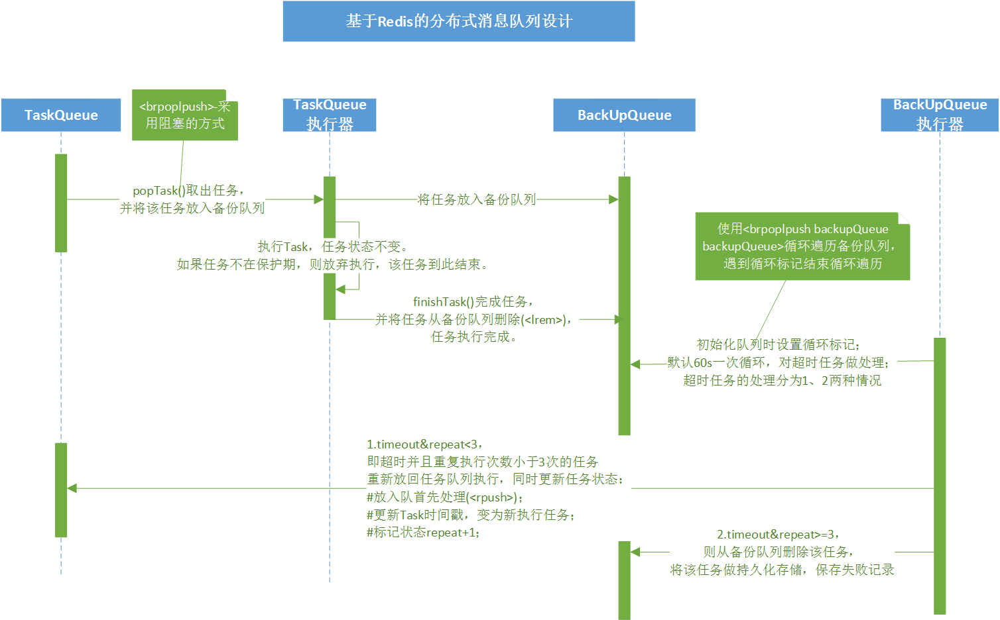
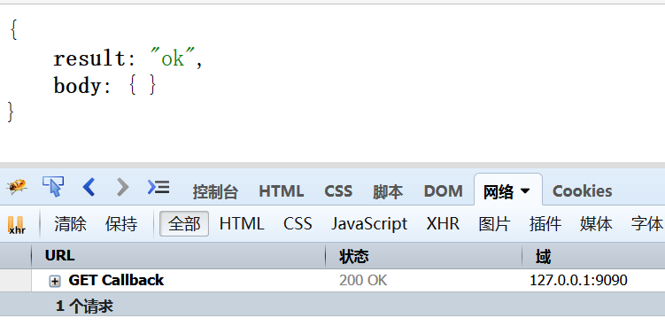
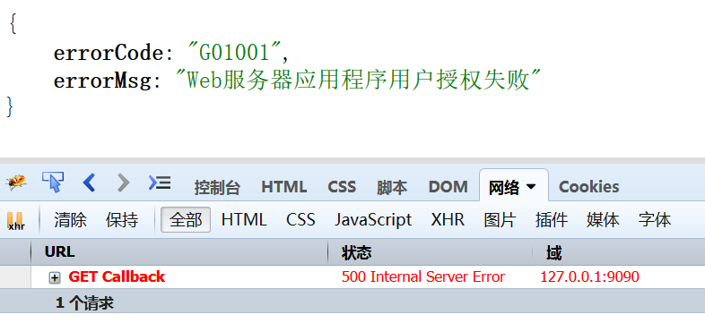

[](https://travis-ci.org/ittalks/futureN4J)

## 一、项目管理

1. 项目管理 ：Maven
2. 版本控制 ：Git

## 二、技术栈

1. ioc容器：Spring
2. web框架：SpringMVC
3. orm框架：Mybatis
4. 数据存储：Mongo/Mysql
5. 缓存：Redis
6. 基于Redis分布式队列
7. 线程池
8. WebService：Apache CXF
9. Log日志：logback
10. HTTP Client：Retrofit封装
11. 基于Redis分布式锁

## 三、项目Module

### 1、Google SDK

#### #1 google oauth2

#### #2 google calendar

**_设计_**

使用**基于Redis的分布式队列**实现数据的拉取与处理。

**_使用_**

---

### 2、Commons Collections

#### #1 基于Redis的分布式队列

**_设计_**



**_使用_**
1. 向队列中Push任务
```java
// 1.获取队列
TaskQueue taskQueue = TaskQueueManager.getTaskQueue(TASK_QUEUE_NAME);
//2.创建任务
String DATA = JSON.toJSONString(OBJECT);
Task task = new Task(taskQueue.getName(), TASK_TYPE, DATA, new Task.TaskState());

//3.将任务加入队列
taskQueue.pushTask(task);
```

2. 消费队列任务
```java

TaskQueue taskQueue = null;
try {
    taskQueue = TaskQueueManager.getTaskQueue(TASK_QUEUE_NAME);
    if (taskQueue != null) {
        while (true) {
            final Task task = taskQueue.popTask();//阻塞方式获取任务

            if (task == null) {
                //获取队列任务失败，采取重试策略
                RetryPolicy.tsleep();
                continue;
            }

            if (!TASK_QUEUE_NAME.equals(task.getQueue())) {
                continue;
            }

            try {
                //可以根据task的type，传入相应的handler处理任务，handler要实现TaskHandler接口。
                task.doTask(TaskHandler taskHandler);
            }  catch (Throwable e) {
                logger.info(e.getMessage());
            }

        }
    }

} catch (Throwable e) {
    logger.info(e.getMessage());
}
```

#### #2 基于Redis的分布式锁
```java
GenericObjectPoolConfig poolConfig = new GenericObjectPoolConfig();
final JedisPool pool = new JedisPool(poolConfig, host, port, timeout, password);
Jedis jedis = pool.getResource();

RedisLock redisLock = new RedisLock(jedis, lockKey, timeoutMsecs, expireMsecs);

try {
    if (redisLock.acquire()) { // 启用锁
        //执行业务逻辑
    } else {
        logger.info("The time wait for lock more than [{}] ms ", timeoutMsecs);
    }
} catch (Throwable t) {
    // 分布式锁异常
    logger.warn(t.getMessage(), t);
} finally {
    if (redisLock != null) {
        try {
            redisLock.release();// 则解锁
        } catch (Exception e) {
        }
    }
    if (jedis != null) {
        try {
            pool.returnResource(jedis);// 还到连接池里
        } catch (Exception e) {
        }
    }
}
```
也可以使用Spring提供的RedisTemplate.
```java
//获取Redis的连接
RedisConnection redisConnection = redisTemplate.getConnectionFactory().getConnection();
Jedis jedis = (Jedis) redisConnection.getNativeConnection();
//创建锁对象
RedisLock redisLock = new RedisLock(jedis, RedisKeyConstant.KEY_REMINDS_GEN_DISTRIBUTE_LOCK);

try {
    if (redisLock.acquire()) { // 加锁成功
        //执行业务逻辑   ------------- start -------------------
        ...
        //执行业务逻辑   ------------- end -------------------
    } else {    //加锁失败
        logger.error("请求分布式锁超时,超时时间 [{}] ms ", redisLock.getAcquireTimeoutInMillis());
        continue;
    }
} catch (Throwable t) {
    // 分布式锁异常
    logger.warn(t.getMessage(), t);
} finally {
    if (redisLock != null) {
        try {
            redisLock.release();// 则解锁
        } catch (Exception e) {
        }
    }
    if (redisConnection != null) {
        try {
            redisConnection.close();// 还到连接池里
        } catch (Exception e) {
        }
    }
}
```

## 四、开发规范
响应返回规范化：

1. 响应成功：



2. 响应失败：

